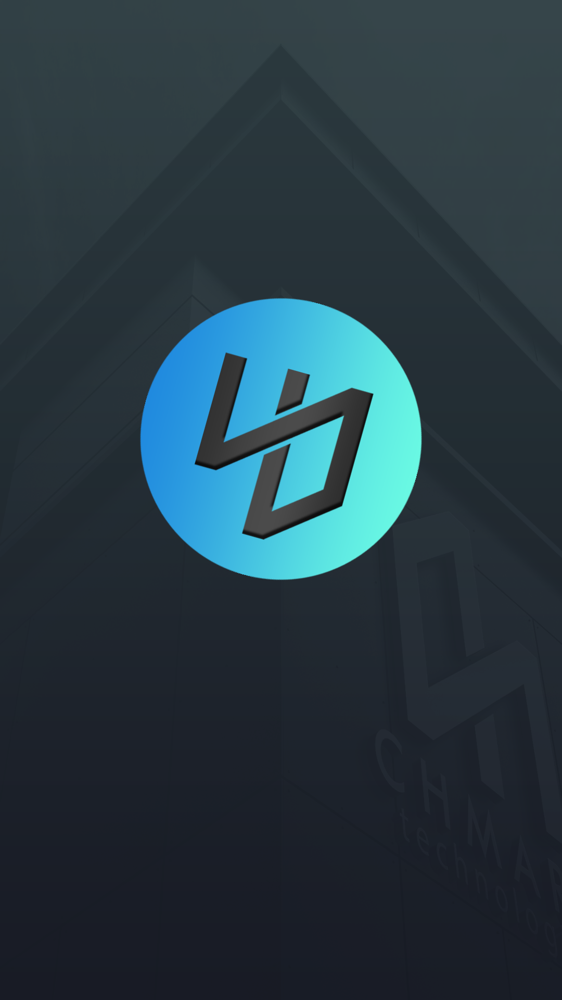
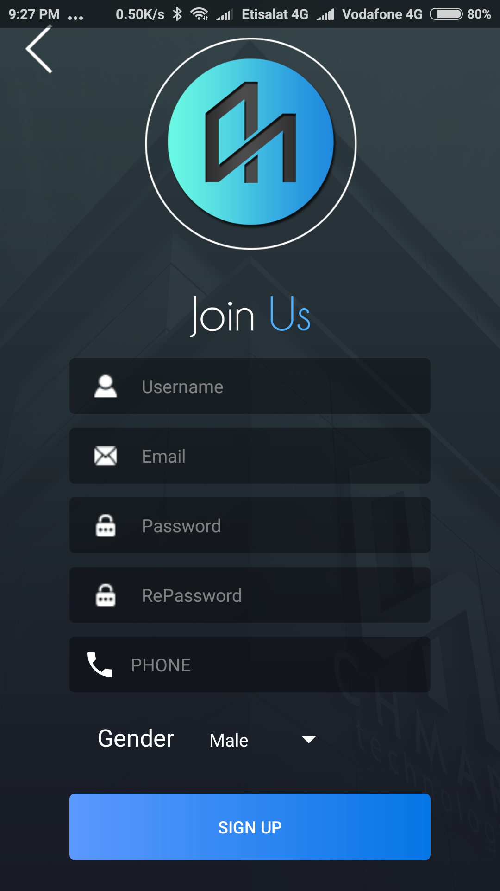
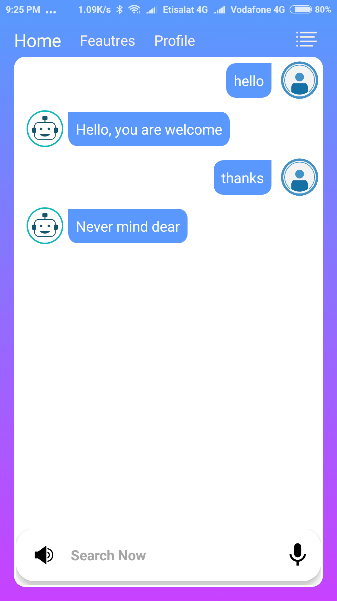
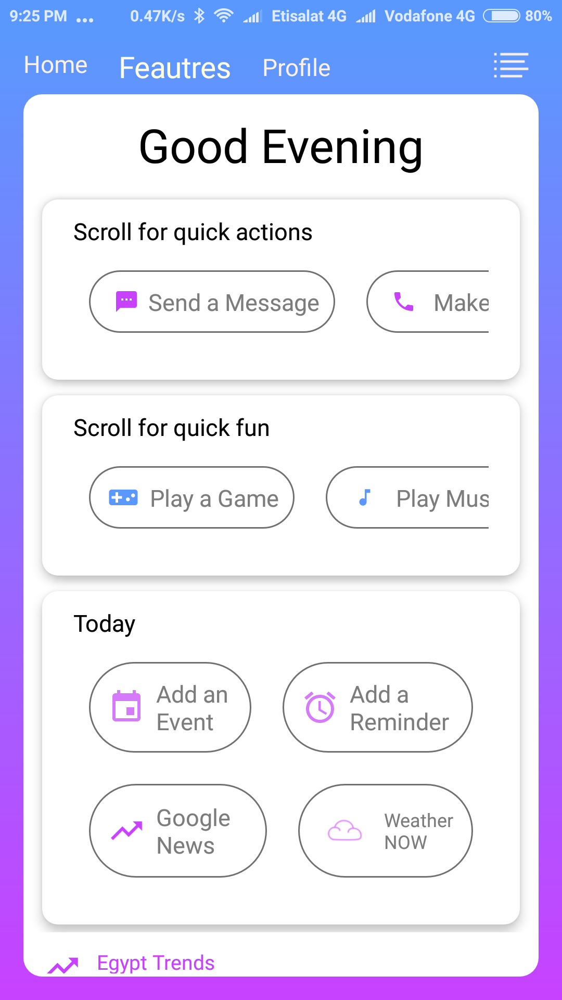
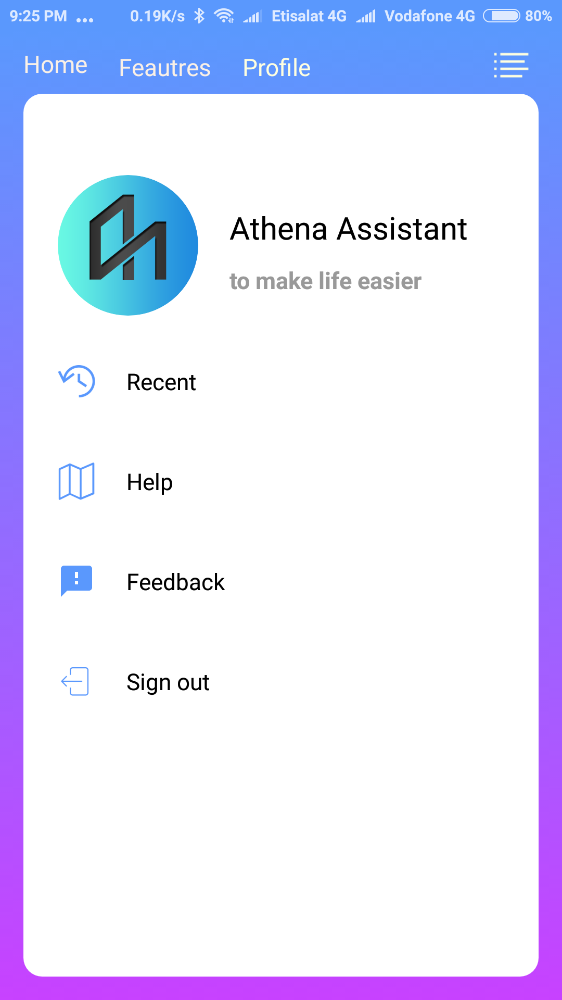
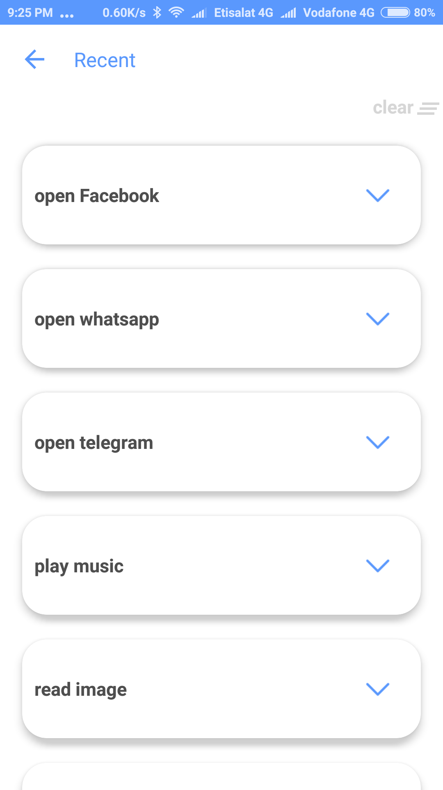
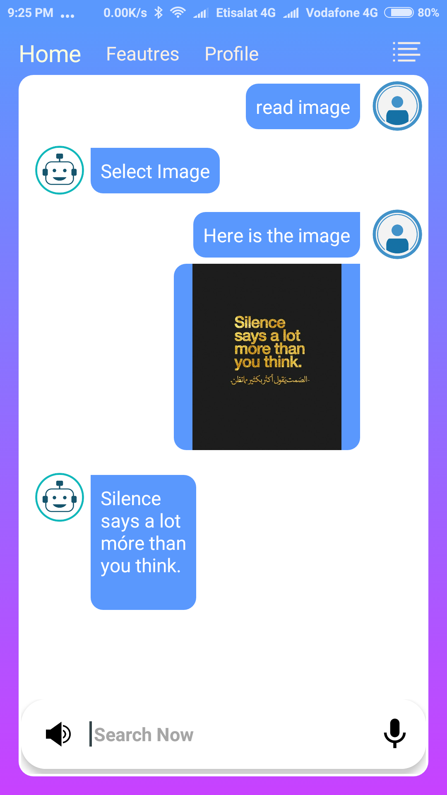
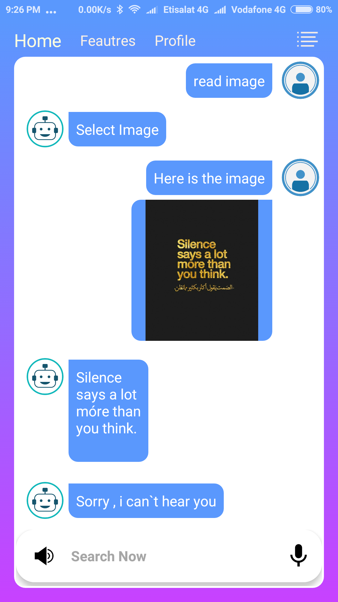
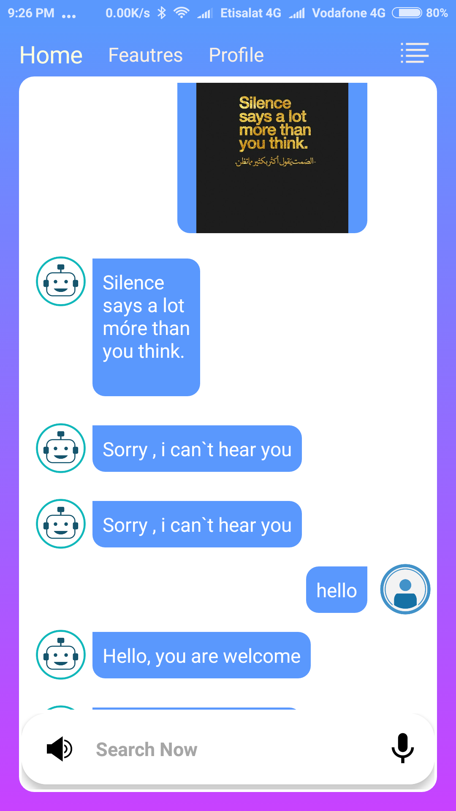
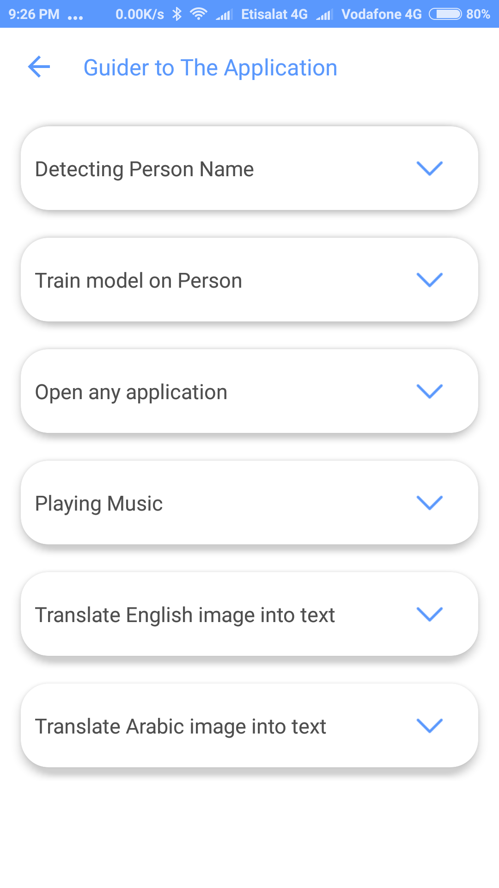

# Athena
#### Graduation Project
  ## Athena is a Powerful Assistant that aims to help different people.
  ## • Main Athena Feautures
  ####  ▪ Chatbot user can chat with app and control to listen to the answer or not.
  ####  ▪ OCR athena can read images in both arabic and english.
  ####  ▪ Image Recognition The Main Feauture as it can recognize people it trained over 1.000.000 face arround world
  ####  ▪ Voice Recognition Athena can answer user aloud.
  
  
  ### Some screenshots of the Big Athena  

  
  
  
  
  
  
  
  
  
  
  
  

